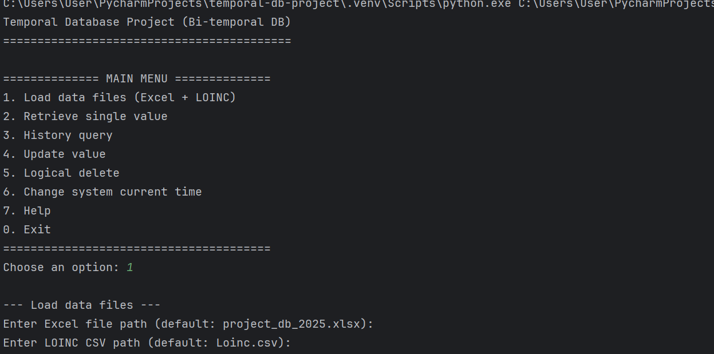
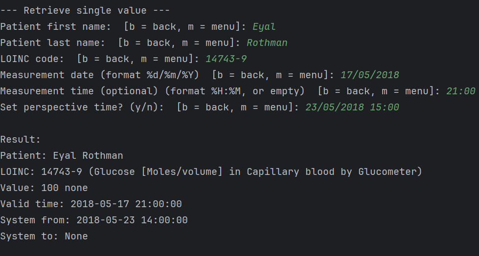
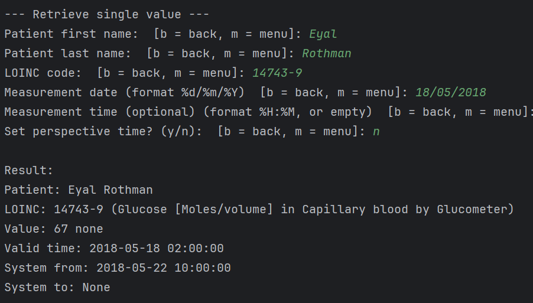
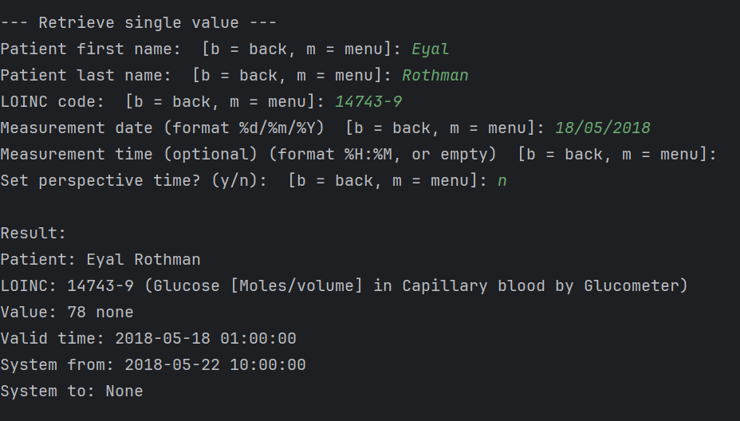
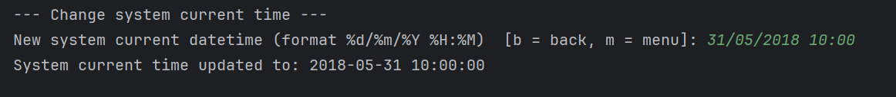
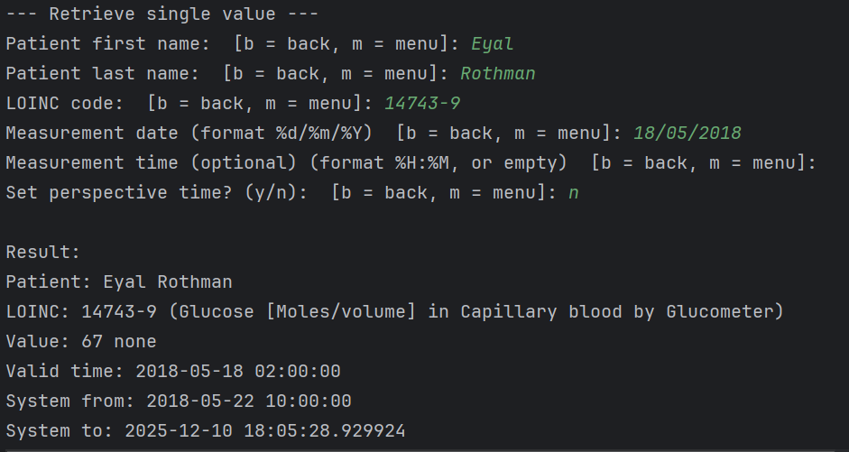

# Bi-Temporal Medical Database Project

This project implements a **bi-temporal medical database** system in Python.  
It supports full separation between:

- **Valid Time** – when the medical measurement was actually taken.
- **Transaction Time** – when the record was inserted, updated, or logically deleted in the system.

The system allows querying historical and current data correctly according to temporal database principles.

---

## ✅ Features

- Load medical data from Excel (`project_db_2025.xlsx`)
- Load LOINC mapping from CSV (`Loinc.csv`)
- Single value retrieval with valid-time and transaction-time logic
- Bi-temporal **history queries**
- **Logical delete** using `system_to` (no physical deletions)
- **Updates** create new versions with the same valid time
- System perspective time control
- Back (`b`) and Menu (`m`) navigation inside the CLI
- Full offline operation (no external services)

---

## 🗂 Project Structure

temporal-db-project/
├── main.py            # CLI interface and menu
├── temporal_db.py     # Core bi-temporal database logic
├── project_db_2025.xlsx  # Medical measurements data
├── Loinc.csv          # LOINC_NUM → LONG_COMMON_NAME mapping
├── .gitignore
└── README.md


---
## 🧑‍🏫 Detailed Setup Instructions for Instructor / Evaluator

This section explains step-by-step how to run the project from scratch, assuming a Windows machine.
(Other OSes are similar, but paths may differ.)

------

### 1️⃣ Install Python
1. Go to:
https://www.python.org/downloads/

2. Download the latest stable Python 3.x for Windows (e.g. Python 3.12).

3. Important: during installation, check the box:

   - Add Python to PATH

4. Finish the installation.

To verify installation:
```bash
python --version
```

You should see something like:
```bash
Python 3.11.x  or  Python 3.12.x
```
-----

### 2️⃣ Install PyCharm (recommended)

You can run the project from a plain terminal, but using PyCharm makes it easier.

1. Go to:
https://www.jetbrains.com/pycharm/download/

2. Download PyCharm Community Edition (free).

3. Install PyCharm with default options.

-----

### 3️⃣ Get the Project Code

There are two options:

#### Option A: Clone from GitHub (recommended)

1. In a browser, open the GitHub repository URL of this project.

2. Click on “Code” → “HTTPS” and copy the URL.

3. Open a terminal (CMD / PowerShell) and run:

```bash
git clone <REPLACE_WITH_REPO_URL>
cd temporal-db-project
```
If Git is not installed, it can be downloaded from: https://git-scm.com/

#### Option B: Download ZIP

1. In GitHub, click “Code” → “Download ZIP”.

2. Extract the ZIP file.

3. You should end up with a folder like:
temporal-db-project/

4. Open that folder in PyCharm (File → Open… → select folder).

-------------------------
### 4️⃣ Open the Project in PyCharm

1. Start PyCharm.

2. Click “Open”.

3. Select the project folder, e.g.:

```bash
C:\Users\<YourUser>\PycharmProjects\temporal-db-project

```
4. Wait for PyCharm to index the project (a short initial loading period).

---

### 5️⃣ Create / Use a Virtual Environment (venv)

PyCharm will typically suggest creating a virtual environment automatically.

If not, you can do it manually:

1. Open the terminal inside PyCharm (bottom panel → “Terminal”).

2. Run:
```bash
python -m venv .venv
```
3. Activate the environment (if needed):

   On Windows (PowerShell):
```bash
.\.venv\Scripts\Activate.ps1
```

You should see (.venv) at the beginning of the terminal prompt, meaning the virtual environment is active.

Note: The .venv/ folder is ignored by Git (see .gitignore) and is local only.

-------------

### 6️⃣ Install Required Python Packages

Inside the project folder, with the virtual environment activated:

```bash
pip install pandas openpyxl
```
- pandas is used to load and process the Excel and CSV files.

- openpyxl is the engine used by pandas to read the .xlsx file.
You only need to do this once per environment.

---

### ▶️ How to Run the Program
#### Option 1: Run Via PyCharm (recommended)

1. In PyCharm, open main.py.

2. At the top-right corner, click the green Run button (▶).

3. A console window (“Run”) will open at the bottom.

You should see:

```bash
Temporal Database Project (Bi-temporal DB)
==========================================
============== MAIN MENU ==============
1. Load data files (Excel + LOINC)
2. Retrieve single value
3. History query
4. Update value
5. Logical delete
6. Change system current time
7. Help
0. Exit
=======================================
Choose an option:
```

#### Option 2: Run Via Terminal

From a terminal inside the project folder (with venv activated):
```bash
python main.py
```

---
## 📥 Step-by-Step Usage – Typical Flow
### 1️⃣ Load the Data Files

From the main menu, choose:
```bash
Choose an option: 1
```
You will be asked:
```bash
Enter Excel file path (default: project_db_2025.xlsx):
Enter LOINC CSV path (default: Loinc.csv):
```
Simply press Enter twice to use the default file names:

- project_db_2025.xlsx

- Loinc.csv

If loading is successful, you will see:
```bash
Data loaded successfully.
System current time is: <current datetime>
```
----

### 2️⃣ Retrieve a Single Value (Example)

Choose:
```bash
Choose an option: 2
```

Example input (corresponding to project query #1):
```bash
Patient first name: Eyal
Patient last name: Rothman
LOINC code: 14743-9
Measurement date (format %d/%m/%Y): 17/05/2018
Measurement time (format %H:%M, or empty): 21:00
Set perspective time? (y/n): y
Perspective datetime (format %d/%m/%Y %H:%M): 22/05/2018 15:00
```
Expected output:
```bash
Result:
Patient: Eyal Rothman
LOINC: 14743-9 (Glucose [Moles/volume] in Capillary blood by Glucometer)
Value: 111
Valid time: 2018-05-17 21:00:00
System from: 2018-05-22 10:00:00
System to: None
```

---
### 3️⃣ Navigation: Back (b) and Menu (m)

In most input prompts, you will see:
```bash
[b = back, m = menu]
```
- Typing b and pressing Enter → returns to the previous step or cancels the current flow.

- Typing m and pressing Enter → returns to the main menu.

This is helpful if a wrong LOINC code, date, or time is entered by mistake.


---

## 🧠 Supported Queries
### 1️⃣ Retrieve Single Measurement

- When date + time are given:

- The system returns a measurement that matches exactly that valid time.

- When only date is given:

- The system returns the latest alive measurement of that day, according to transaction time and logical deletions.

### 2️⃣ History Query

- Shows all historical versions of a measurement within a valid-time range.

### 3️⃣ Update

- Implements a bi-temporal update:

- Closes the current version (sets system_to).

- Inserts a new version with:

- Same valid_time

- New system_from

- New value

### 4️⃣ Logical Delete

Implements logical deletion:

- No physical deletion from the dataset.

- system_to is set for the last alive version.

- Old versions remain available for history queries.

### 5️⃣ Change System Time

Sets the current system time (“perspective time”) used by queries when the user chooses not to provide a perspective explicitly.

This allows:

- “What did the database look like on 31/05/2018?”

- “What value would the doctor see back then?”

-------------------
## ✅ Verified Project Scenarios

The following core scenarios from the project specification have been tested and validated:

| Scenario                                    | Description                                              | Expected Result | Status |
| ------------------------------------------- | -------------------------------------------------------- | --------------- | ------ |
| Query 1                                     | Specific date-time, earlier perspective                  | 111             | ✅      |
| Query 2                                     | Same date-time, later perspective                        | 100             | ✅      |
| Query 3                                     | Date only, latest alive measurement                      | 67              | ✅      |
| After Logical Delete                        | Date only, after logical deletion of a later measurement | 78              | ✅      |
| Historical Perspective (change system time) | Same date only, but older system time → older value      | 67              | ✅      |


---
## E.G for the questions from project_db_2025:
uploads Exel file:


###  Answers:
-    -  question 1:
     
-   - question 2:
     
-   - question 3:
    
-   -question 4: 
   
-   -question 5:
   
-   -question 6:
     
     
    

---

## 🧪 Bi-Temporal Logic Explanation

- Valid Time = when the medical event (measurement) actually occurred.

- Transaction Time = when the record was inserted/updated/deleted in the system.

- If multiple versions exist at the same valid time:

- The version with the latest system_from is considered the current one at that transaction time.

- Logical deletion:

- Implemented by setting system_to (no physical delete).

- Historical queries can reconstruct what the database “looked like” at any past system time.

------------------


## 🔐 Offline Guarantee

This project runs completely offline:

- No web requests

- No external APIs

- No cloud services

- All computation and logic are local, using only:

- Python

- pandas

- Excel (.xlsx) and CSV files

- -----

## 👨‍🎓 Author

Developed by:
[Romi Sinizkey]
Computer Science Student – Temporal Databases Project

---------
## 📌 Notes for Evaluation

- The implementation follows bi-temporal database theory taught in the course.

- All deletions are logical and preserve historical versions.

- All required queries from the project document were validated against the given dataset.

- The code is structured, documented, and can be easily extended for additional query types.
- ---

